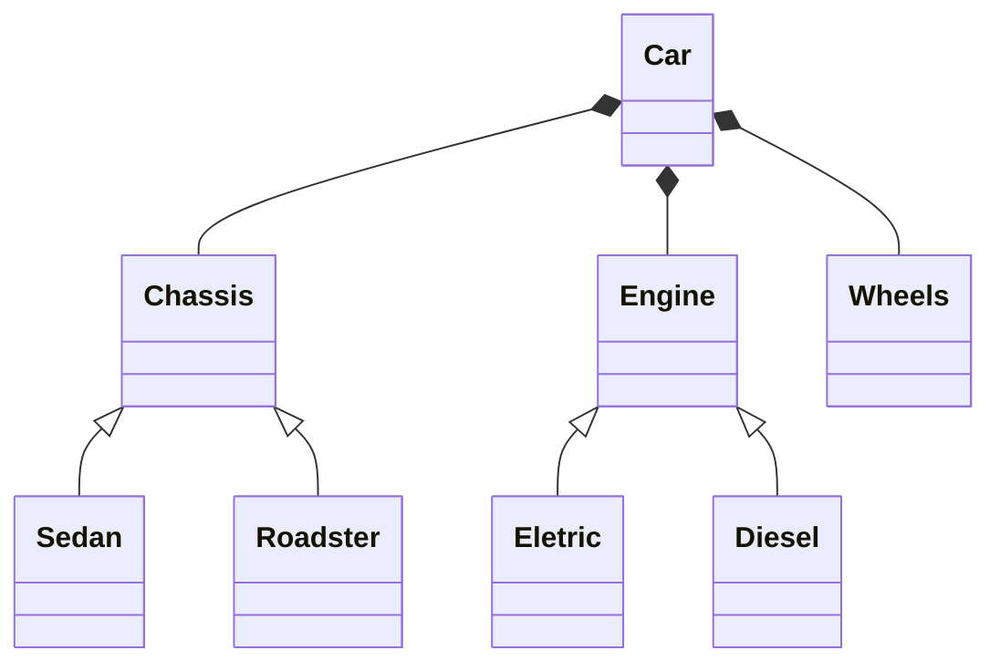

# Builder
+ Separates construction of the object from its representation
* Build complex object one step at a time
- Encapsulate the build

## Implementation

### Notes
The **builder** pattern has an emphasis on the steps of building and not on shared characteristics 