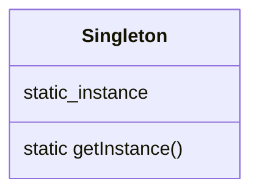

# Singleton
+ An object that is globally accessible
* There must be only **one** instance of the class

```mermaid
classDiagram
    class Singleton
    Singleton   : static_instance
    Singleton   : static getInstance()
```